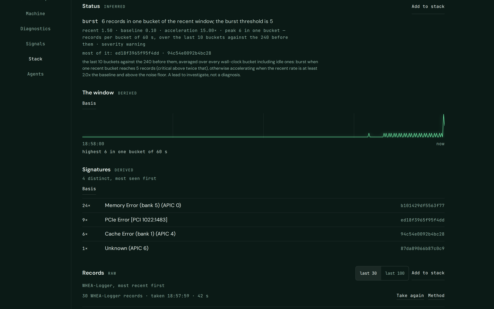
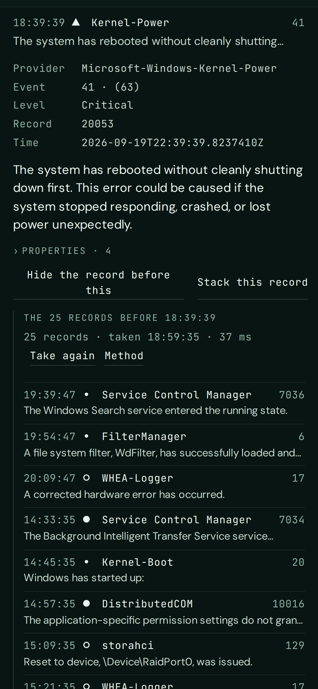
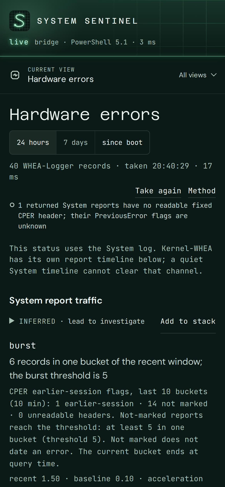

# System Sentinel

[](https://github.com/SuperDuperDave/system-sentinel/actions/workflows/ci.yml)
[](https://github.com/SuperDuperDave/system-sentinel/releases/latest)
[](LICENSE)

**A stethoscope for your computer.** A Windows machine keeps a record of itself: the event log, the hardware error log, the crash dumps, what it is made of and how it is configured. System Sentinel gathers that record, shows it to you in one place, lets you choose what matters, and hands it on to the AI conversation of your choice. It is built for two users at once: the person at the dashboard, and the agent running on the same machine.

Every read of the machine passes through one boundary, the API. The dashboard, a phone and a local agent (Claude Code, Codex and the like) are three clients of that one interface. An agent troubleshooting the machine calls the tool instead of writing and running its own scripts.

## What it looks like

<table>
<tr>
<td width="63%" valign="top"></td>
<td width="18%" valign="top"></td>
<td width="18%" valign="top"></td>
</tr>
</table>

The screens show the tool rendering a synthetic record built from Windows' own providers, ids and message templates, so nothing from any real machine appears.

The dashboard address remembers the view you opened (`?view=machine`, for example) and a moment you opened in Record. You can copy it to revisit that screen, use browser back and forward, or link to a section. The recipient still needs their own signed-in session.

## What it reads

| Reading | What it is |
| --- | --- |
| `events`, `record` | Records from the System and Application logs by level, from a moment or from this session's start, and the records *before* a moment |
| `crash`, `faults` | The stops the machine did not plan, each composed into one: when it stopped as Windows estimated it, when it came back, the bug check if one was written, the dump that belongs to it and the last record before it — and, while it kept running, the programs that crashed or hung and the kernel's own live reports |
| `whea`, `storms` | Hardware-error records with their binary payload decoded beside them, and the same records over a window in wall-clock buckets, grouped by signature, with burst and acceleration flags |
| `dumps`, `dump_header` | The crash-dump inventory and an on-demand structural readout of one file: its exact header bytes, kernel bug check or minidump streams and exception, with the raw readout available in Crashes |
| `system`, `hardware`, `hardware.cpu`, `.gpu`, `.board`, `.storage`, `.network`, `drivers` | The snapshot, the fingerprint and configuration, one subsystem at a time, and driver changes |
| `pcie`, `power`, `memory`, `constraints` | The PCIe fabric, power configuration and transitions, physical memory, devices present and not working |
| `reliability` | Windows' reliability related events, including informational entries, and its hourly stability index, rolled up by day and event type |
| `signals` | Leads across the readings and the recent log: suppressions, gaps, pressure, transitions, mismatches |
| `health` | Whether the tool can reach Windows at all, and how: the shell it found, a round trip, the decoder, and the live sessions carrying your questions |

Every reading comes back in one envelope. Its **outcome** says whether the machine was observed (`ok`, `empty`) or not (`failed`, `unavailable`, `denied`, `timeout`), so a collection failure is never mistaken for a clean machine. Its **sections** keep what Windows said (`raw`) apart from what the tool computed (`derived`), what does not change (`invariant`) and what is only a lead (`inferred`). Its **method** is the query, so the evidence can be reproduced by hand. By default nothing in a response carries a serial number, the computer name, a user name or a MAC address; a caller asks for those by name.

The **stack** is the evidence you or your agent chose to hand on. It lives on the machine, so the desktop, the phone and the agent see one stack. It composes into one text, led by a prompt from a library you can edit; the dashboard copies it to the clipboard, and an agent reads the same text from a route. A **capture** is every reading, the stack and the composed text in one ZIP on disk, with a manifest that says exactly what is in it. Nothing leaves the machine unless a person sends it.


## Installing it

Download `SystemSentinel.exe` from [the latest release](https://github.com/SuperDuperDave/system-sentinel/releases/latest) and double-click it, wherever your browser put it. It installs itself: the file copies itself into `%LOCALAPPDATA%\SystemSentinel\` and starts from there. It is the whole tool in one file: the server starts on `http://127.0.0.1:8000/`, the browser opens on the dashboard already signed in, and the mark sits in the system tray with *Open dashboard*, *Sign in another device*, *Copy address for agents*, *Start with Windows*, a submenu named for the version it is running, and *Quit*. Nothing else needs to be installed. [docs/DEPLOY.md](docs/DEPLOY.md) has the details, the two prompts you can paste to your agent instead (one installs the release and updates it, one installs from source), and the optional steps for running at logon and reaching the machine from your phone.

**Updating it.** From 1.1.0, choose *Check for updates…* in the tray's version submenu. System Sentinel checks the latest published GitHub release when you ask, shows its version, and asks before downloading. It checks the downloaded executable against GitHub's asset digest and the release's SHA-256 list, then starts that verified file through its existing replacement handoff. Your token, readings, stack, prompts and captures are not sent to GitHub; the updater does not poll in the background. Your local data stays in place. From source, `system-sentinel update` checks the version and `system-sentinel update --install` installs a newer Windows release. An installation of 1.0.1 still needs one manual download and double-click to gain this action.

**Removing it.** *Remove from this computer…* in the same submenu names what goes (the program, the token, the stack, the prompts, the captures, the Startup entry) and what stays (the file you downloaded; an agent's registration, undone by `claude mcp remove system-sentinel`), then does it.

Which version you have is in the file's *Properties*, in the tray's submenu, in the dashboard's Agents view, and as `version` on `GET /api/readings`.

**Where the file comes from.** Releases from 1.0.1 are built from a tag by this repository's own workflow, on a GitHub Windows runner, and carry a build provenance attestation: `gh attestation verify SystemSentinel.exe --repo SuperDuperDave/system-sentinel` checks the file you downloaded against the commit it was built from. Every push runs the test suite on Linux and on a Windows runner that is not the machine this was built for, host tests included, and fails the moment a tracked file carries a hostname, a user name or a local path. The download and install path is taken on a clean Windows image by the harness in `build/windows/sandbox/`.

From source, on the Windows machine, with Python 3.11 or newer and Node 22 or newer:

```
git clone https://github.com/SuperDuperDave/system-sentinel.git
cd system-sentinel
python -m venv .venv
.venv\Scripts\python -m pip install -e .
cd dashboard && npm ci && npm run build && cd ..
.venv\Scripts\system-sentinel check
.venv\Scripts\system-sentinel serve
```

`check` proves the bridge to Windows before anything is asked of it. `serve` runs the API and the dashboard; the dashboard asks once for the access token the tool created on first start, which `system-sentinel token` prints. `system-sentinel launch` is the tray launcher from source, with the `[launcher]` extra installed.

From WSL on the same machine the tool runs the same way, reading Windows through `powershell.exe`; that is how it is developed.

## For agents

Register it once and every reading is a tool:

```
claude mcp add --transport http system-sentinel http://127.0.0.1:8000/mcp --header "Authorization: Bearer $(system-sentinel token)"
```

Any MCP client reaches the same address over streamable HTTP with the same header; any shell reaches the same evidence with `curl`. The reading to reach for when someone says *it froze* is `crash`: it composes each unplanned stop out of the records of its session — when the machine stopped as Windows estimated it, when it came back, the bug check if one was written, the dump on disk that belongs to it, and the last record the machine managed before it went. Give it the moment instead and it reports what the first start at or after that moment announced, which is the only thing that can answer for a freeze.

```
curl -H "Authorization: Bearer $TOKEN" \
  "http://127.0.0.1:8000/api/readings/crash?moment=2026-09-19T21:30:00Z"
```

Then `record` is what the machine was doing as it went: give it the stop's `started_at` and it hands back the records before that, oldest first.

```
curl -H "Authorization: Bearer $TOKEN" \
  "http://127.0.0.1:8000/api/readings/record?before=2026-09-19T21:41:07Z&count=25"
```

```json
{
  "reading": "record",
  "params": { "before": "2026-09-19T21:41:07Z", "count": 25, "log": "System" },
  "outcome": "ok",
  "count": 25,
  "sections": [
    {
      "name": "records",
      "class": "raw",
      "data": [
        {
          "RecordId": 307341,
          "Id": 17,
          "Level": 3,
          "LevelDisplayName": "Warning",
          "ProviderName": "Microsoft-Windows-WHEA-Logger",
          "MachineName": "<host>",
          "TimeCreated": "2026-09-19T21:38:52.417Z",
          "Message": "A corrected hardware error has occurred."
        }
      ]
    }
  ],
  "redacted": ["host", "user"]
}
```

Trimmed to one record of the twenty-five. The whole envelope also carries `asked_at`, `took_ms`, `warnings`, `error`, and `method`: the query that produced the reading, so the evidence can be reproduced by hand. [docs/API.md](docs/API.md) is the interface, written for an agent to read without the source; the live reference is `/api/docs`.

## The source

`sentinel/` is the Python package: the bridge to Windows, the reading envelope and catalog, the readings, the redaction policy, the token boundary, the stack, the stream, captures, the MCP projection and the CLI. `dashboard/` is the Vite and React dashboard, which builds into `sentinel/static` and is served from the same origin. `tests/` runs anywhere through a fake bridge and, where there is one, against the real machine. `docs/design/` owns the identity. The working method behind the project, and the records each session resumes from, are kept privately; the part a contributor needs is in the files below.

The identity, the copy and the figure on [mainthread.ai](https://mainthread.ai/work/system-sentinel/) are the reference presentation; the page states only what this source implements.

What changed and when: [CHANGELOG.md](CHANGELOG.md). How to work on it: [CONTRIBUTING.md](CONTRIBUTING.md). The boundary, and how to report something that crosses it: [SECURITY.md](SECURITY.md). How it was made: [docs/HOW-THIS-WAS-BUILT.md](docs/HOW-THIS-WAS-BUILT.md). How it differs from Event Viewer, Reliability Monitor, WhoCrashed and HWiNFO: [docs/COMPARISON.md](docs/COMPARISON.md).

## What it does not do

No live telemetry as a service, no prediction, no full crash-dump analysis, no diagnosis. The tool can read a dump file's bounded header when Windows permits it, but it does not inspect its stack or memory or name a cause. A burst of corrected errors, a gap in the log or a correlated event is a lead to investigate; the reading belongs to the person or the agent holding the evidence.

## License

[MIT](LICENSE). The fonts are under the SIL Open Font License, with their license texts beside them in `dashboard/public/fonts/`.
